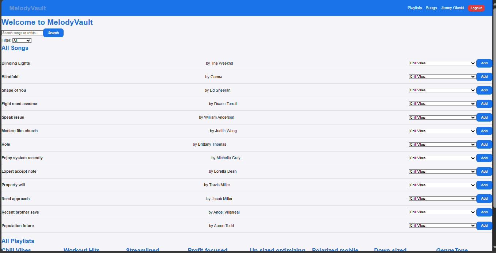
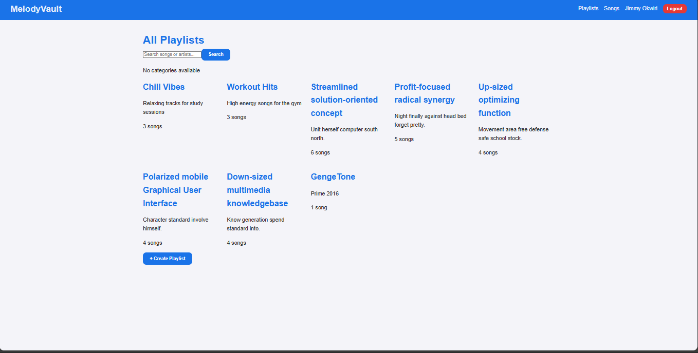
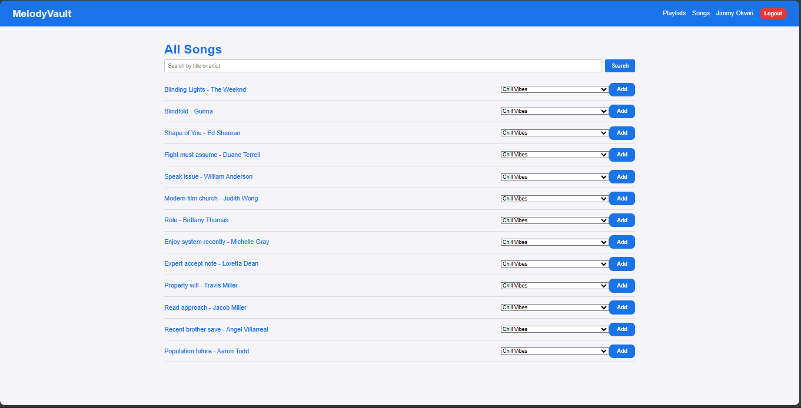
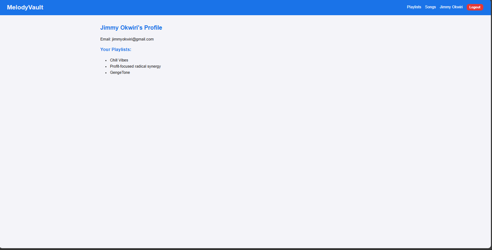

# MelodyVault Project
# 🎶 MelodyVault

## Description

MelodyVault is a full-stack music playlist manager where users can create playlists, add songs, and manage their music library with ease. Built with a Flask REST API backend and a React frontend, the app blends functionality with a smooth user experience.

---

## ✨ Features
- 👤 User Accounts – register and manage your profile
- 📂 Playlists – create and customize playlists to suit your vibe
- 🎵 Songs – add, view, and explore music with details (title, artist, genre, duration)
- 🖥️ Full CRUD Support – create, read, update, and delete across resources
- 🖥️ Full CRUD Support – create, read, update, and delete across resources
- ⚡ Interactive UI – responsive React interface for seamless navigation

## User Stories

A user I can:
- View all my playlist and their songs 
- Create a new playlist with a name and description 
- Add songs to a playlist 
- Remove songs from a playlist 
- Delete a playlist I no longer want  
- Edit or update the name or description of a playlist  
- View details of a single playlist  
- View a list of all available songs in the system  
- Search for song by the title or artist  
- Filter songs in a playlist (by artist, genre )   
- “Like” or rate song and playlist  
- Sort songs in a playlist (by name, duration, added date) 


## 🛠️ Tech Stack

Frontend

- ⚛️ React (with Vite for fast builds)
- 🎨 CSS / Tailwind (custom styling optional)

Backend

- 🐍 Flask (REST API)

- 🗄️ SQLAlchemy & Flask-Migrate

- 🔑 Flask-RESTful & Marshmallow

Database

- PostgreSQL / SQLite (development)

## Getting Started

1. Clone the Repository

``` 
git clone https://github.com/yourusername/MelodyVault.git
cd MelodyVault
```
- Take
a look at the directory structure.

```
$ tree 
.
├── .gitignore
├── CONTRIBUTING.md
├── LICENSE.md
├── package-lock.json
├── package.json
├── Pipfile
├── Pipfile.lock
├── README.md
├── client/
│  ├─ public/
│  │  ├─ index.html
│  │  │  └─ favicon.ico
│  ├─ src/
│  │  ├─ api/
│  │  │  └─ api.js
│  │  ├─ components/
│  │  │  ├─ FilterDropdown.js
│  │  │  ├─ Footer.js
│  │  │  ├─ NavBar.js
│  │  │  ├─ PlaylistCard.js
│  │  │  ├─ SearchBar.js
│  │  │  ├─ SongCard.js
│  ├─ context/
│  │  └─ AuthContext.js
│  │  ├─ pages/
│  │  │  ├─ AddSongToPlaylist.js
│  │  │  ├─ CreatePlaylist.js
│  │  │  ├─ Home.js
│  │  │  ├─ Login.js
│  │  │  ├─ PlaylistDetails.js
│  │  │  ├─ Playlists.js
│  │  │  ├─ Profile.js
│  │  │  ├─ SignUp.js
│  │  │  ├─ SongDetail.js
│  │  │  ├─ Songs.js
│  │  ├─ styles/
│  │  │  ├─ main.css
│  │  │  │  ├─PlaylistCard.css
│  │  ├─ App.js.js
│  │  ├─ index.js
├── .gitignore
├── package-lock.json
├── package.json
├── README.md
├── server
│  │  ├── app.py
│  │  ├── config.py
│  │  ├── models.py
│  │  ├── resources.py
│  │  ├── routes.py
│  │  ├── seed.py
├── .gitignore
├── package-lock.json
├── package.json
└── README.md
```
2. Backend Setup
```
pipenv install
pipenv shell
cd server
```
You can run your Flask API on localhost:5555, Links to an external site, by running: 
``` 
python server/app.py
```
3. Frontend Setup

```
cd client
```
To download the dependencies for the frontend client, run:
```
npm install --prefix client
```

You can run your React app on localhost:3000, Links to an external site, by running:
```
npm start --prefix client
```
The app will now be running on:

- Frontend → http://localhost:3000

- Backend API → http://localhost:5555

## 📸 Screenshots

Home Page 
---


Playlist Page 
---


Songs Page
---


Profile Page
---



### 🤝 Contributing
Contributions are welcome! 🎉
1. Fork the repo
2. Create a feature branch
3. Commit changes
4. Open a Pull Request

### 💡 Inspiration

Music is universal. MelodyVault is built for music lovers who want control over their playlists — simple, fast, and powerful.

### Credits
 This project was done by two brilliant individuals:
   1. Jimmy Okiwri
   2. Nicholas Kiama

We would like to thank Moringa for such a good opportuninity to do this project aand help us test the skills we gathered so far .